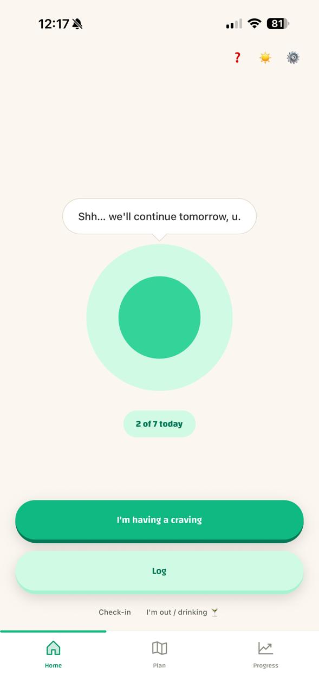
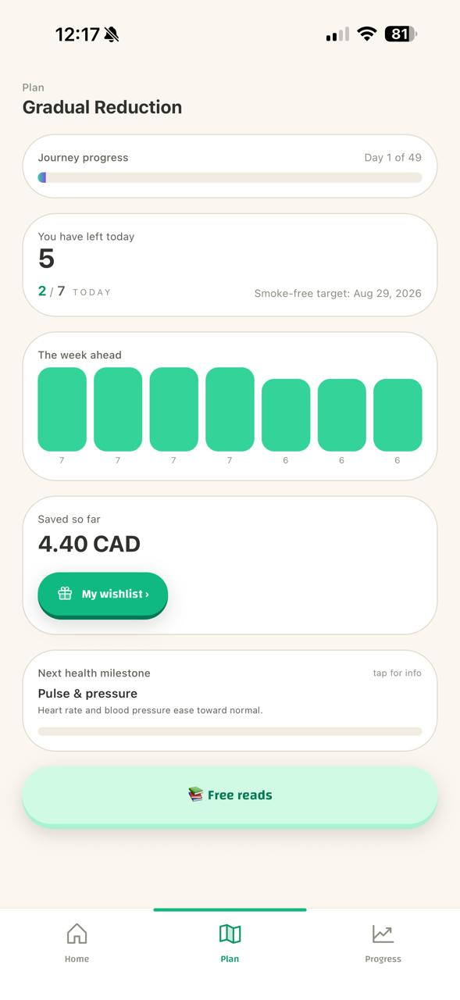
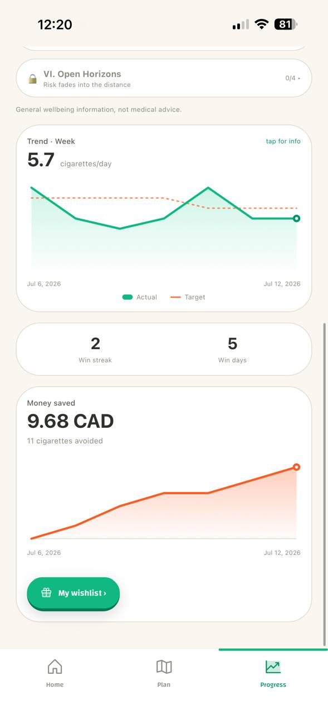
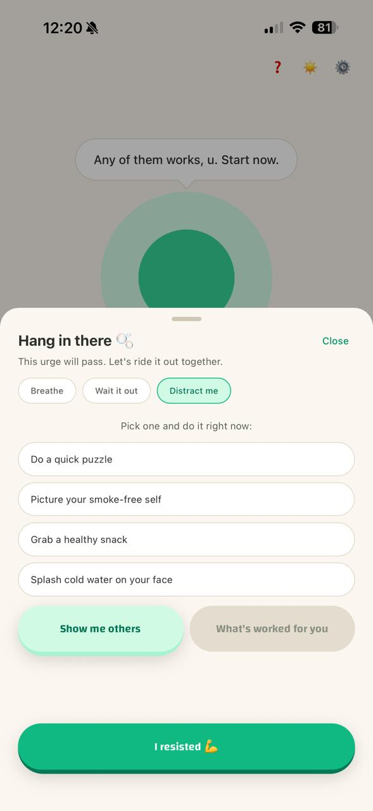

# Wisp 🌫️

> A warm, fully offline quit-smoking companion that adapts to _any_ smoker — routing each person onto a **cold-turkey** or **gradual-reduction** track inside a guided, CBT-informed program, with a companion whose wellbeing visibly reflects your progress.

[](https://github.com/renteria-luis/wisp/actions/workflows/ci.yml)
[](./LICENSE)

Wisp is a cross-platform mobile app (iOS-first), built end to end on Linux with Expo + React Native. It is **100 % on-device**: no account, no backend, no telemetry, no network calls at all. The "personalised plan" is computed by a deterministic, fully tested rule engine — **never an LLM at runtime** — so it is private, offline, and explainable.

<p align="center">
  
  
  
  
</p>

---

## Why this exists

Most quit-smoking apps fail at one of two things. Wisp is built to get both right.

**It guides, it doesn't just measure.** The app walks you through a structured, adaptive plan instead of dumping statistics and walking away. It tells you what today looks like, adapts tomorrow based on what actually happened, and re-plans without ever punishing you.

**It adapts to the kind of smoker you are.** A short onboarding routes each person onto a **Cold Turkey** or a **Gradual Reduction** track from their consumption, dependence and readiness, rather than imposing one philosophy on everyone. You can override the suggestion.

And a third, quieter one: **warmth**. Almost every quit app is clinical. Wisp's companion visibly reflects how you're doing, which makes progress something you _feel_ rather than something you read off a chart.

The design rule underneath all of it: **a slip never wipes your history.** Progress is anchored on a rolling trend, not a brittle streak, because a streak counter turns one bad evening into a reason to give up entirely.

## Features

**The plan**

- Adaptive onboarding that assigns a track and builds a dated, personalised plan.
- A reduction curve you can see: today's allowance, the week ahead, and the full journey.
- Trend-based adherence and automatic re-planning — non-punitive by design.

**Daily use**

- One-tap logging of a cigarette (with trigger, note, and whether it was shared or gifted) or a resisted craving.
- A craving toolkit: guided breathing, a "this passes in N minutes" timer, and quick distractions that learn which ones actually worked for you.
- A daily mood check-in, a morning greeting, and a situational "I'm out drinking" mode that raises support for a few hours.
- Local trigger notifications around your own smoking windows, with quiet hours.

**Progress**

- Trend chart over a week / month / all time, plus a day-grouped cigarette history you can filter and backfill.
- Money saved, with a "what you could buy instead" goal, and a wishlist you spend real savings on.
- A running recovery model with 30 cited health milestones, from 20 minutes to 15 years.

**The companion**

- Vitality — the companion's mood and health track your actual behaviour.
- A coin economy that rewards smoke-free _duration_ (exponentially), spent on cosmetics and treats.
- A 16-step guided tour that runs on a **throwaway sandbox world**, so a new user really taps Log, really sees the cigarette land in the chart, and really resists a craving — without touching a single byte of their real data.

**Craft**

- English + Spanish, with a test that enforces locale parity.
- Light, dark, and a vivid theme; follows the system by default.
- Haptics-only feedback, deliberately silent — [see below](#why-there-is-no-sound).
- Everything exportable and erasable from Settings, in one tap.

## Running it

You need [Node 22+](https://nodejs.org) and, to use it properly, a phone with **[Expo Go](https://expo.dev/go)**.

```bash
git clone https://github.com/renteria-luis/wisp.git
cd wisp
npm install
npm start        # scan the QR code with Expo Go (iOS) or the Expo Go app (Android)
```

That's the real thing: the whole app runs in Expo Go, on a real phone, for free — no Mac and no Apple Developer account needed.

```bash
npm run web      # a local browser preview
```

The browser preview is useful for a quick look at the screens, but it is **not** the product. Wisp stores its logs in SQLite (which needs `SharedArrayBuffer`, so it only works on a server sending COOP/COEP headers — `expo start` does, most static hosts don't), and haptics, local notifications and the gesture-driven sheets have no meaning in a browser. There is deliberately **no hosted web demo**: it would misrepresent the app. Look at the screenshots, or run it on a phone.

To put a real, installable build on an iPhone without paying Apple's $99/year, see **[docs/SIDELOADING.md](./docs/SIDELOADING.md)**.

### Quality gates

```bash
npm run lint       # ESLint (eslint-config-expo)
npm run typecheck  # tsc --noEmit, strict
npm test           # Jest — 104 tests across the engine, stores and content
```

All three run on every push in [CI](./.github/workflows/ci.yml).

## Architecture

The rule that keeps this honest: **all product logic lives in a pure, UI-free, unit-tested TypeScript engine.** Data flows one way — SQLite → stores → engine → UI — and the engine imports nothing from React. That is why the plan can be tested without rendering anything, and why it can be explained to a user rather than hand-waved.

```
app/                    Expo Router screens (onboarding, tabs, modals)
src/
  engine/               pure, tested product logic — no UI, no I/O
    planEngine.ts         track assignment
    reduction.ts          the reduction curve
    adherence.ts          trend, adherence, re-planning
    vitality.ts           companion mood/health
    economy.ts            the coin economy
    savings.ts            money saved
    health.ts             the recovery timeline
    triggers.ts           trigger windows → notification schedules
  data/                 expo-sqlite schema, migrations, repositories
  store/                Zustand stores (persisted to AsyncStorage)
  components/           companion, charts, craving toolkit, guided tour, UI
  content/              companion lines, distractions
  i18n/                 en / es
  notifications/        local scheduling
  theme/                design tokens, shared with Tailwind
```

**Stack:** Expo SDK 54 (managed) · React Native 0.81 · React 19 · TypeScript (strict) · Expo Router · NativeWind 4 · Zustand · expo-sqlite · Reanimated 4 · react-native-svg · expo-notifications (local only) · expo-haptics · i18next · Jest · GitHub Actions.

Deeper design notes live in **[PROJECT.md](./PROJECT.md)**; current status in **[PROGRESS.md](./PROGRESS.md)**.

## Why there is no sound

Deliberate, not an omission. A craving lands at work, at dinner, on the street — and an app that chirps when you tap "I smoked" is an app you can't open in front of people, which is exactly when you need it most. Touch says the same thing, privately. So haptics are the only feedback channel, they all route through one module that decides how hard anything is ever allowed to buzz, and they have a switch.

Note what is missing from that module: there is no failure or warning haptic. Logging a cigarette feels like any other tap. **The app does not buzz at you for smoking.**

## Privacy

No account, no cloud, no analytics, no network calls. Everything lives on the phone, and Settings will hand it all back to you as JSON — or erase it — in one tap.

The recovery timeline shows standard, cited public-health information and is **not medical advice**.

## License

Source code: [MIT](./LICENSE).

The artwork — the companion characters, their cosmetics, the app icon — is original to this project and **isn't** covered by it. Read the code, learn from it, reuse it; please leave the drawings alone.

---

_A personal project, built for one person and generalised to any smoker._
